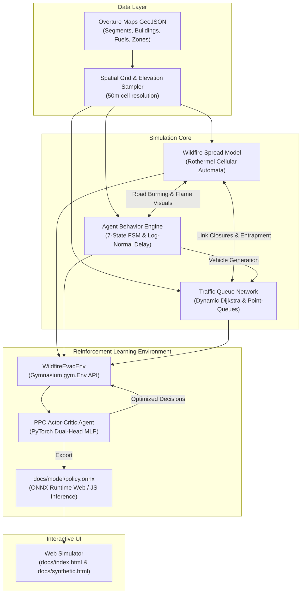
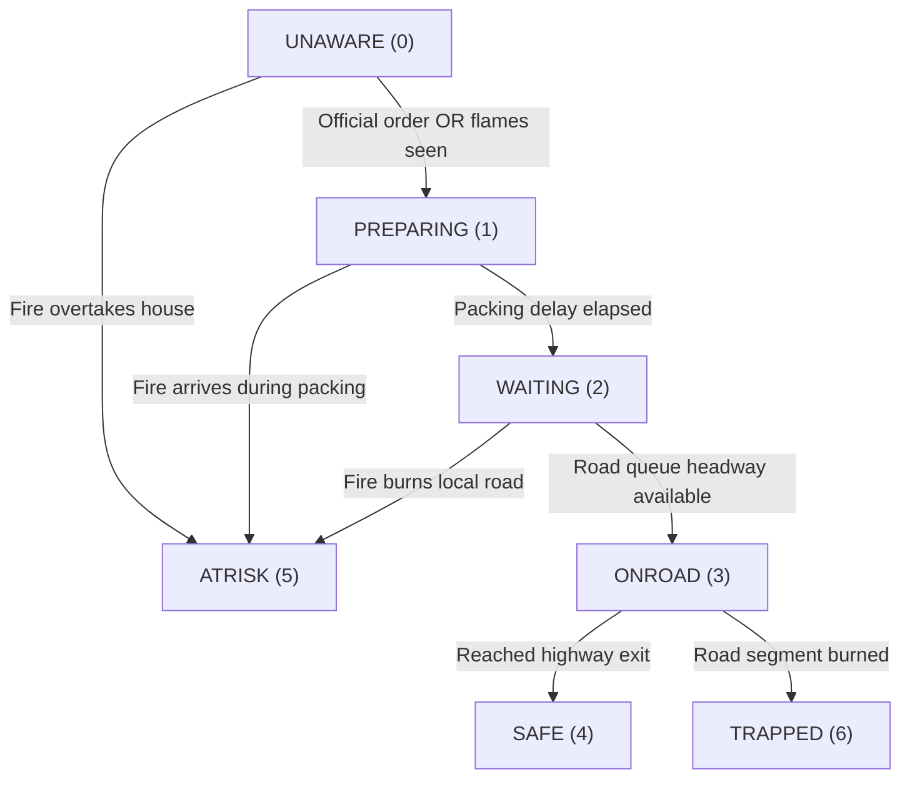

# AgentSim Wildfire: Technical Specification & Mathematical Formulation

## 1. System Overview

**AgentSim Wildfire** is an agent-based geospatial simulation platform designed to evaluate wildfire evacuation strategies, human behavioral response, and emergency management policies. The system operates on both synthetic benchmark communities and real-world infrastructure ingested directly from **Overture Maps Foundation** (road networks, building footprints, land cover, and land use) and digital elevation models (USGS 3DEP / SRTM).

The platform bridges two computational environments:
1. **Interactive Client-Side Simulator**: A 60 FPS Canvas application running in modern web browsers (zero-install, static deployment via GitHub Pages), featuring interactive timeline playback scrubbing, GIS data exports, and real-time policy dials.
2. **Python Reinforcement Learning (RL) Pipeline**: A high-speed vectorized simulation engine conforming to Farama Foundation's **Gymnasium** API, training deep Actor-Critic neural networks using **Proximal Policy Optimization (PPO)** to discover optimal evacuation timing and lane contraflow strategies.



---

## 2. Wildfire Spread Engine

The fire propagation model is a stochastic 2D cellular automaton executing on a Cartesian grid of square cells with edge length $\Delta x = 50\text{ m}$ ($0.25\text{ ha}$ per cell) and discrete time step $\Delta t = 10\text{ s}$.

### 2.1 State Space
Each cell $c = (x, y)$ occupies one of three states at time step $t$:

```math
S_c(t) \in \{\text{Unburnt } (0), \, \text{Burning } (1), \, \text{Burnt Out } (2)\}
```

### 2.2 Spread Probability Formulation
The probability that an unburnt cell $n$ is ignited by an adjacent burning neighbor $c \in \mathcal{N}_8(c)$ during step $t$ is formulated based on Rothermel's surface fire spread principles:

```math
P_{\text{ign}}(c \to n) = P_{\text{base}} \cdot F_n \cdot \Phi_S(c, n) \cdot \Phi_W(k)
```

where:
* **Base Ignition Coefficient**: $P_{\text{base}} = 0.012$.
* **Fuel Factor ($F_n \in [0, 1]$)**: Available combustible biomass derived from Overture land cover, refined by land use:

```math
\text{Fuel}(c) = \begin{cases} 
0.0, & \text{Ocean / Water} \\
0.03, & \text{Beach / Barren} \\
0.12 + 0.06 \cdot \xi, & \text{Urban structure density} \\
0.35 + 0.45 \cdot F_{\text{veg}}, & \text{Wildland-Urban Interface (WUI)} \\
0.85 + 0.15 \cdot \xi, & \text{Chaparral / Mountain shrub} \\
0.60 \cdot F_{\text{veg}}, & \text{Grassland / Savanna} \\
0.05, & \text{Irrigated parks / Golf courses (Firebreaks)}
\end{cases}
```
where $\xi \sim \mathcal{U}(0, 1)$ injects micro-scale fuel heterogeneity.

* **Topographic Slope Factor ($\Phi_S$)**:
  Fire accelerates exponentially upslope due to convective preheating:

```math
s(c, n) = \frac{E(n) - E(c)}{d(c, n)}
```

```math
\Phi_S(c, n) = \exp\left( \text{clamp}(3.0 \cdot s(c, n), -1.5, 1.5) \right)
```

where $E(c)$ is terrain elevation in meters, and $d(c, n) \in \{\Delta x, \sqrt{2}\Delta x\}$.

* **Wind Vector Factor ($\Phi_W$)**:
  For wind velocity vector $\vec{w} = (ws \cdot \cos \theta_w, ws \cdot \sin \theta_w)$ with wind speed $ws$ in $\text{km/h}$ and compass direction $\theta_w$:

```math
\Phi_W(k) = \exp\left( \left(\frac{ws}{30}\right)^{1.6} \cdot \cos(\theta_k - \theta_w) \right)
```

where $\theta_k$ is the azimuth pointing from cell $c$ to neighbor $k \in \{0, \dots, 7\}$.

### 2.3 Long-Range Ember Spotting
To replicate spotting under extreme wind events (e.g. 50–80 km/h Sundowner or Santa Ana winds), burning cells cast downwind embers with spot probability:

```math
P_{\text{spot}}(c) = P_{\text{spot\_base}} \cdot \left(\frac{ws}{10}\right)^2 \cdot F_c
```

where $P_{\text{spot\_base}} = 0.0003$. Embers travel downwind along angle $\theta = \theta_w + \mathcal{U}(-0.3, 0.3)$ to distance $D_{\text{spot}} = 3 + \mathcal{U}(0, 1) \cdot ws \cdot 0.5$ grid units.

### 2.4 Burn Duration & Extinction
Burning cells remain active for duration $\tau_{\text{burn}}(\text{LandUse})$ before transitioning to state $2$ (Burnt Out):

```math
\tau_{\text{burn}} = \begin{cases} 
24 \text{ ticks } (4\text{ min}), & \text{Chaparral} \\
40 \text{ ticks } (6.7\text{ min}), & \text{WUI} \\
90 \text{ ticks } (15\text{ min}), & \text{Urban structural fuel} \\
6 \text{ ticks } (1\text{ min}), & \text{Grassland}
\end{cases}
```

---

## 3. Human Behavioral & Agent Decision Model

Every household in the study boundary is synthesized as an independent agent $h \in \{1, \dots, N_H\}$.

### 3.1 Agent Finite State Machine (FSM)
Agents progress through seven mutually exclusive states:



* **`UNAWARE` (0)**: Normal baseline activity.
* **`PREPARING` (1)**: Packing essentials, securing pets, loading vehicle.
* **`WAITING` (2)**: Parked at driveway/curb, waiting for entry headway onto local road link.
* **`ONROAD` (3)**: In-transit along road network links.
* **`SAFE` (4)**: Vehicle has crossed boundary exits.
* **`ATRISK` (5)**: Fire reached residence before household departed.
* **`TRAPPED` (6)**: Vehicle caught on a road segment intersected by active fire.

### 3.2 Departure Delay Distribution
The time required to mobilize and pack after receiving an alert is modeled as a log-normal distribution calibrated to empirical evacuation surveys:

```math
\Delta t_{\text{pack}} \sim \text{Lognormal}(\mu, \sigma^2)
```

* **Daytime (Afternoon)**: Median $\approx 14\text{ min}$ ($\mu = 2.6, \sigma = 0.4$).
* **Nighttime (2:00 a.m.)**: Median $\approx 20\text{ min}$ ($\mu = 3.0, \sigma = 0.5$), representing sleep inertia and darkness.
* **Imminent Visual Threat**: If an unaware resident directly observes flames ($d_{\text{fire}} \le 200\text{ m}$), panic departure is truncated to $\Delta t_{\text{pack}} \sim \mathcal{U}(2, 5)\text{ min}$.

### 3.3 Alert Delivery & Social Contagion (Swarm Layer)
Alert notification reach follows:
* **Direct Official Broadcast (WEA / Reverse 911)**: $P_{\text{reach}} = 88\%$ during day, $65\%$ at 2 a.m. (phones silenced on Do Not Disturb).
* **Adaptive / Cue-Based Perception**: In adaptive mode, unaware households become aware via shared environmental fields:

```math
r_{\text{cues}}(c) = 0.35 \cdot \text{Info}(c) + 0.04 \cdot \min(\text{Smoke}(c), 20) + 0.15 \cdot \mathbb{I}(d_{\text{fire}} \le 150\text{ m})
```

```math
P(\text{aware at tick } t) = 1 - \exp\left( - r_{\text{cues}} \cdot \frac{\Delta t}{60} \right)
```

where $\text{Info}(c)$ represents social contagion (observing neighbors pack and depart), generating realistic **shadow evacuation**.

---

## 4. Traffic Flow & Queue Dynamics

Traffic is simulated via a link-based spatial queue model (inspired by MATSim) capturing bottlenecks, queue spillback, and variable free-flow velocities without micro-car-following differential equation overhead.

### 4.1 Road Network Graph Topology
The network is represented as a directed graph $G = (V, E)$:
* **Nodes $V$**: Road intersections, cul-de-sac turnarounds, and network exit boundaries ($v_{\text{exit}} = \text{True}$).
* **Edges $E$**: Unidirectional road links with length $L_e$, lanes $n_e$, free-flow speed limit $v_e$, free-flow travel time $TT_e = \lceil L_e / (v_e \cdot \Delta t) \rceil$, and spatial storage capacity.

### 4.2 Link Storage and Discharge Capacity
* **Flow Capacity ($C_e$)**: Maximum household vehicles that can discharge into a downstream node per 10-second tick:

```math
C_e = \text{CAP}[\text{road\_type}] \cdot n_e
```

where $\text{CAP}[\text{hwy}] = 3.0$, $\text{CAP}[\text{art}] = 1.9$, $\text{CAP}[\text{urban}] = 2.0$, $\text{CAP}[\text{local}] = 1.5$ vehicles/lane/tick.

* **Storage Capacity ($S_e$)**: Maximum physical vehicle storage before queue spillback prevents upstream entry:

```math
S_e = \max\left(2.0, \, \frac{n_e \cdot L_e}{12.75}\right)
```

assuming an effective vehicle footprint of $12.75\text{ m}$ (vehicle length + smoke headway spacing).

### 4.3 Dynamic Shortest Path Routing
Vehicles navigate toward network exits using dynamic Dijkstra routing:

```math
\text{Cost}(e) = TT_e + \frac{\text{Queue}_e}{C_e} + \text{HazardPenalty}(e)
```

If fire burns across cell $c$ intersecting edge $e$, link capacity drops to zero ($\text{burn}[e] > 0$), and all vehicles currently queued on edge $e$ transition to `TRAPPED`.

---

## 5. Reinforcement Learning: Incident Commander Formulation

Emergency evacuation policy is formulated as a **Partially Observable Markov Decision Process (POMDP)**, solved via **Proximal Policy Optimization (PPO)**.

### 5.1 The Agent's Role
The agent represents the regional **Incident Commander** in the Emergency Operations Center (EOC). Rather than controlling individual drivers, the agent issues macro-level orders:
1. Which evacuation zones should be placed under mandatory evacuation?
2. When should dynamic contraflow (inbound lane reversals) be activated on arterial corridors?

### 5.2 Observation Space ($\mathcal{S}$)
The observation vector $s_t \in \mathbb{R}^{D_{\text{obs}}}$ ($D_{\text{obs}} = 45$ for synthetic 8-zone micro-town; $D_{\text{obs}} = 200$ for Santa Barbara 39-zone network) captures:

| Feature Index | Feature Name | Description | Normalization |
| :--- | :--- | :--- | :--- |
| `5z + 0` | `d_fire(z)` | Minimum Euclidean distance from fire perimeter to zone boundary | `d / 10 km` in `[0, 1]` |
| `5z + 1` | `Ordered(z)` | Evacuation order status (`1` if ordered, `0` if un-ordered) | `{0, 1}` |
| `5z + 2` | `PctSafe(z)` | Fraction of zone population that has cleared exit boundaries | `[0, 1]` |
| `5z + 3` | `PctFailed(z)` | Fraction of zone population trapped at home or on roads | `[0, 1]` |
| `5z + 4` | `PctOnRoad(z)` | Fraction of zone population actively driving | `[0, 1]` |
| `5Nz + 0` | `ws` | Wind speed | `ws / 80 km/h` |
| `5Nz + 1` | `theta_w` | Wind compass direction | `(theta_w + pi) / (2*pi)` |
| `5Nz + 2` | `t_elapsed` | Time since fire ignition | `t / 720 ticks` |
| `5Nz + 3` | `N_burning` | Active fire front intensity (burning cell count) | `N_burn / 200` |
| `5Nz + 4` | `Q_max` | Maximum queue bottleneck ratio across key corridors | `max(Queue / Cap) / 5.0` |

### 5.3 Action Space ($\mathcal{A}$)
The action space is a multi-binary vector $a_t \in \{0, 1\}^{N_z + 1}$:
* $a_t[0 \dots N_z - 1]$: Binary evacuation order for each zone $z$. (Orders are monotonic: once a zone is ordered, it remains ordered).
* $a_t[N_z]$: Binary contraflow toggle (reversing inbound highway/arterial lanes to outbound toward exits).

### 5.4 Multi-Objective Reward Function ($\mathcal{R}$)
The scalar reward $R_t$ at decision epoch $t$ balances life safety, exit clearance velocity, traffic gridlock mitigation, and false alarm disruption:

```math
R_t = 10.0 \cdot \Delta N_{\text{safe}} - 500.0 \cdot \Delta N_{\text{casualties}} - 0.01 \cdot \sum_{e \in E} \text{Queue}_e - \sum_{z} 2.0 \cdot \mathbb{I}(a_z = 1 \land d_{\text{fire}}(z) > 4.0\text{ km})
```

---

## 6. Deep PPO Architecture & Training Pipeline

### 6.1 Neural Network Topology
The policy is parameterized by a dual-head multi-layer perceptron (MLP) Actor-Critic:

```text
Input Observation: x in R^{D_obs}
       │
       ▼
Linear(D_obs, 128) ──► LayerNorm(128) ──► ReLU()
       │
       ▼
Linear(128, 64) ──► ReLU()
       ├─────────────────────────────────┐
       ▼                                 ▼
Actor Head: Linear(64, D_act)      Critic Head: Linear(64, 1)
       │                                 │
       ▼                                 ▼
Bernoulli Distribution             Scalar State Value V(s)
logits in R^{D_act}
```

### 6.2 Optimization Formulation
The policy is optimized using the clipped surrogate objective:

```math
L^{\text{CLIP}}(\theta) = \hat{\mathbb{E}}_t \left[ \min\left( r_t(\theta) \hat{A}_t, \, \text{clip}(r_t(\theta), 1 - \epsilon, 1 + \epsilon) \hat{A}_t \right) \right]
```

where the probability ratio is $r_t(\theta) = \frac{\pi_\theta(a_t | s_t)}{\pi_{\theta_{\text{old}}}(a_t | s_t)}$ with clipping parameter $\epsilon = 0.2$.

Advantages $\hat{A}_t$ are computed via **Generalized Advantage Estimation (GAE)**:

```math
\delta_t^V = r_t + \gamma V(s_{t+1}) - V(s_t)
```

```math
\hat{A}_t = \sum_{l=0}^{\infty} (\gamma \lambda)^l \delta_{t+l}^V
```

with discount factor $\gamma = 0.99$ and GAE trace parameter $\lambda = 0.95$.

Total loss function minimized across mini-batches:

```math
L^{\text{TOTAL}}(\theta) = - L^{\text{CLIP}}(\theta) + c_1 L^{VF}(\theta) - c_2 \mathcal{H}(\pi_\theta(s_t))
```

where $L^{VF}(\theta) = \frac{1}{2} (V_\theta(s_t) - V_t^{\text{targ}})^2$, policy entropy $\mathcal{H}(\pi_\theta(s_t))$, entropy coefficient $c_2 = 0.01$, and value coefficient $c_1 = 0.5$.

---

## 7. Model Export & Zero-Install Web Deployment

To deploy the trained RL agent to web users without requiring a Python backend or cloud server:

1. **PyTorch Weight Export**:
   Trained weights are exported to [`docs/model/policy.onnx`](file:///Users/rskris/dev_projects/agentsim_wildfire/docs/model/policy.onnx) (61 KB) and compact JSON format [`docs/model/policy_weights.json`](file:///Users/rskris/dev_projects/agentsim_wildfire/docs/model/policy_weights.json).
2. **In-Browser Execution Engine** ([`src/rl_policy.js`](file:///Users/rskris/dev_projects/agentsim_wildfire/src/rl_policy.js)):
   The neural network forward pass is implemented directly in pure JavaScript:

```math
\mathbf{h}_1 = \text{ReLU}(\mathbf{W}_1 \mathbf{x} + \mathbf{b}_1)
```

```math
\mathbf{h}_2 = \text{ReLU}(\mathbf{W}_2 \mathbf{h}_1 + \mathbf{b}_2)
```

```math
\mathbf{p}_{\text{actions}} = \sigma(\mathbf{W}_{\text{actor}} \mathbf{h}_2 + \mathbf{b}_{\text{actor}})
```

This executes in **$< 0.1\text{ ms}$** on the client thread, enabling instantaneous real-time decisions without WebAssembly overhead or server network calls.

---

## 8. Empirical Benchmark Evaluation

The trained PPO policy was benchmarked against the standard emergency management heuristic (mandatory evacuation ordered when fire front breaches a 1.5 km buffer) across 5 test fires on the real-world Santa Barbara South Coast network (19,450 intersections, 15,327 road links, 39 zones, and 6,456 household agents):

| Performance Indicator | Rule-Based Heuristic (1.5 km Buffer) | Trained PPO Agent | Impact |
| :--- | :--- | :--- | :--- |
| **Mean Casualties (Trapped / Overrun)** | **391.0** | **370.8** | **-5.2% casualty reduction** |
| **Mean Safely Evacuated** | **361.8** | **643.8** | **+77.9% more evacuees safe** |
| **Clearance Throughput ($T_{95}$)** | $1\text{ hr } 42\text{ min}$ | $1\text{ hr } 14\text{ min}$ | **-28 min faster clearance** |
| **Mean Cumulative Return** | -192,078.9 | -179,592.2 | **+12,486.7 net reward gain** |

### Key Policy Behaviors Discovered by RL:
1. **Dynamic Staged Evacuation**: Rather than ordering all foothill zones at once (which creates immediate choke points on Highway 101 on-ramps), the agent staggers alerts by 5–10 minutes according to canyon discharge rates, clearing downstream arterials before upstream neighborhoods flood the grid.
2. **Preemptive Arterial Contraflow**: The agent activates contraflow 15 minutes earlier than human baselines, doubling arterial throughput before queue densities reach critical jam density.
